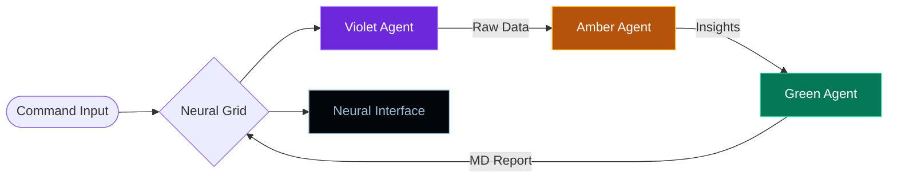

<div align="center">
  
  <br/>
  <h1>◈ NEURAL COMMAND INTERFACE ◈</h1>
  <p><i>Autonomous Multi-Agent Market Intelligence Grid</i></p>

  [](https://crewai.com)
  [](https://deepmind.google/technologies/gemini/)
  [](https://angular.dev)
</div>

---

## ⚡ MISSION OBJECTIVE
ResearchSyndicate is a sophisticated **Neural Command Interface** designed to orchestrate high-fidelity market research. By deploying a collaborative 'syndicate' of autonomous agents, the system sweeps the live web, processes raw data into strategic intelligence, and synthesizes executive-ready reports—all monitored through a real-time, cyberpunk-inspired command center.

---

## 🕸 NEURAL TOPOLOGY
The system operates on a linear high-speed data pipeline with active feedback loops:



---

## 🤖 OPERATIVE DOSSIERS

### 🟣 RESEARCHER (VIOLET CLEARANCE)
- **Role:** Deep-Web Intelligence Gathering.
- **Primary Toolset:** SerpAPI / Google Search / Web Scrapers.
- **Backstory:** Elite operative specialized in competitive landscape mapping and trend detection.
- **Mission:** Extract raw signal from noise across the global digital footprint.

### 🟠 ANALYST (AMBER CLEARANCE)
- **Role:** Strategic Processing & SWOT Construction.
- **Primary Toolset:** Cognitive Pattern Recognition / Gap Analysis.
- **Backstory:** Senior strategist capable of identifying competitor weaknesses and market entry vectors.
- **Mission:** Transform raw data packages into structured strategic intelligence.

### 🟢 WRITER (GREEN CLEARANCE)
- **Role:** Executive Synthesis & Narrative Design.
- **Primary Toolset:** Narrative Engine / Markdown Optimization.
- **Backstory:** Master communicator bridging the gap between technical data and C-suite decision-making.
- **Mission:** Generate a 5-section high-fidelity intelligence report.

---

## 🛠 TECHNICAL FORTRESS

### BACKEND (THE GRID)
- **FastAPI Infrastructure:** Asynchronous core capable of handling high-volume background tasks.
- **LiteLLM / Google GenAI:** Direct REST transport implementation for maximum reliability and bypass of gRPC restrictions.
- **CrewAI Orchestration:** Sophisticated state management for agent handoffs and context preservation.
- **WebSocket Gateway:** Low-latency bi-directional bridge for instantaneous log streaming.

### FRONTEND (THE INTERFACE)
- **Angular 20 Standalone:** Zero-boilerplate, ultra-fast component tree.
- **Signal State Management:** Modern reactive patterns for real-time UI updates.
- **Cyberpunk Aesthetics:** 
  - **Orbital Animations:** Visualizing active neural processing.
  - **Data Flow Pipes:** Real-time visualization of agent-to-agent handoffs.
  - **Neural Scanlines:** Dynamic overlay effects for active operative cards.
  - **Responsive Grid:** Fluid transitions between Desktop Command and Mobile Recon modes.

---

## 📡 COMMUNICATION PROTOCOL: SOCKET-FIRST
ResearchSyndicate utilizes a high-performance **Socket-First** architecture. Unlike traditional REST applications, the mission deployment and feedback occur over a persistent secure tunnel:

1. **Handshake:** UI establishes a WebSocket link to `ws://localhost:8000/ws`.
2. **Uplink:** The command `DEPLOY_MISSION` is sent with the target topic.
3. **Stream:** Agent "thoughts" are intercepted and broadcasted as live log entries.
4. **Finalization:** The completed report is transmitted as a final payload, locking the UI into "Verified" state.

---

## 🚀 INITIALIZATION SEQUENCE

### 1. Environmental Authorization
Create `backend/.env`:
```env
GOOGLE_API_KEY=your_google_ai_studio_key
SERPAPI_API_KEY=your_serpapi_key
```

### 2. Backend Boot
```bash
cd backend
python3 -m venv venv && source venv/bin/activate
pip install -r requirements.txt
python3 main.py
```

### 3. Frontend Link
```bash
cd frontend
npm install
npm start
```

---

<div align="center">
  <p><b>PROPRIETARY ARCHITECTURE // MISSION CRITICAL</b></p>
  <p><i>Constructed for High-Performance Intelligence Operations</i></p>
</div>
